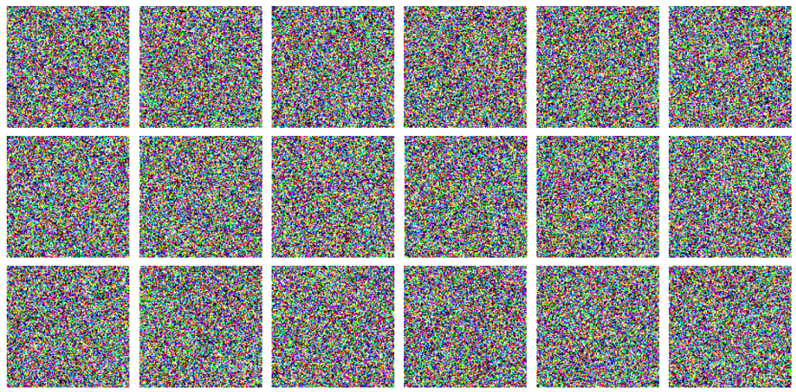
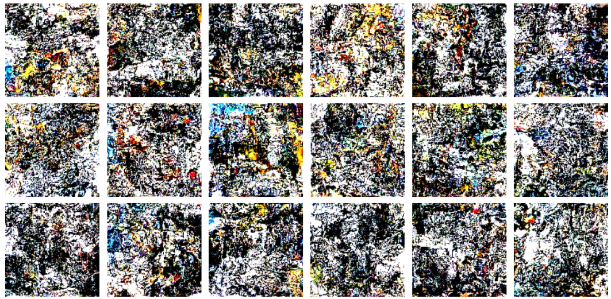
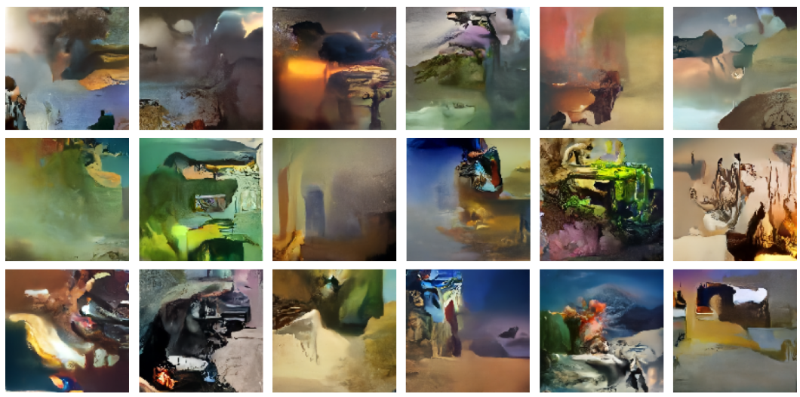
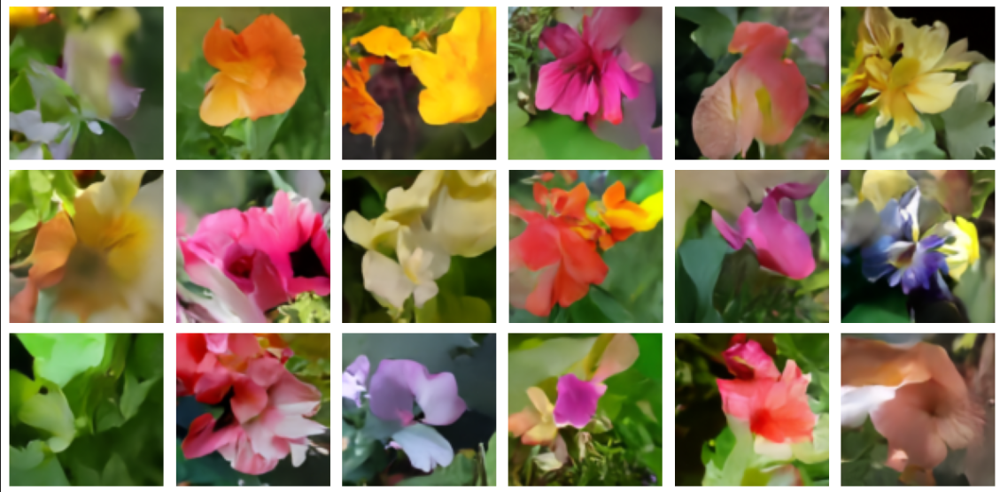

# ddim-stable-diffusion
Diffusion model that generates surrealism art work depending on the data given

## Dataset
The dataset was created using different websites to download images of the concept of surrealism.
The dataset consists of +-6947 images.

## Model
The model that was used is the example code from Keras DDIM tutorial. This was used to test the validity of the dataset.

## Model performance during training:
  

## Model inference on Oxford flower dataset and Surrealism dataset:
 

